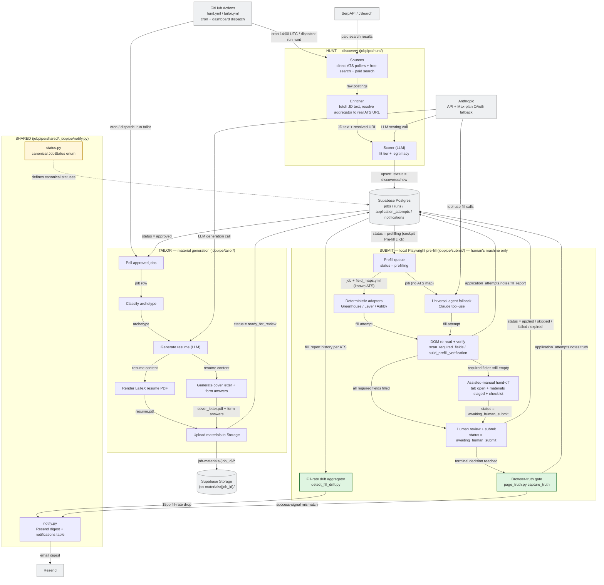
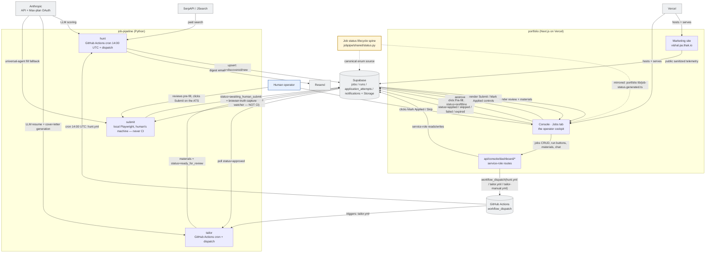

# Architecture

Two diagrams for this repo: the **pipeline** (hunt → tailor → submit) and the
**system context** (how this repo and the `portfolio` repo connect). Both are
plain-text Mermaid so they render on GitHub, in any markdown viewer, and stay
easy to update alongside the code. Polished standalone HTML renders (Mermaid
via CDN, light theme) live in [`docs/diagrams/`](diagrams/):
[`pipeline.html`](diagrams/pipeline.html) and
[`system-context.html`](diagrams/system-context.html).

## 1. Pipeline architecture

**Legend:** yellow subgraphs are in-repo stages (`jobpipe/hunt`,
`jobpipe/tailor`, `jobpipe/submit`, `jobpipe/shared`); grey boxes are external
systems (Supabase, Anthropic, GitHub Actions, SerpAPI/JSearch, Resend); the
amber box is the canonical `status.py` enum every stage transition keys off.
Green boxes mark the two most recent additions to submit: the post-decision
browser-truth gate and the fill-rate drift aggregator.

## 2. System context — job-pipeline ⇄ portfolio

**This diagram is canonical here.** The copy committed in
`portfolio/docs/ARCHITECTURE.md` is a reference mirror — update this one
first, then sync the copy.

**Legend:** yellow subgraphs are each repo's collapsed internals; blue is the
human operator; grey boxes are external systems (Supabase, GitHub Actions,
Anthropic, SerpAPI/JSearch, Resend, Vercel); the amber box is the shared
status-lifecycle contract. **Supabase is the only bus** — job-pipeline and
portfolio never call each other directly, they meet at the database.
**Submit is the one exception to CI**: it runs locally on the human's machine
and is only ever given intent (a status row), never dispatched by GitHub
Actions.

## Keeping this current

These diagrams are hand-maintained, not generated, so they will drift the
moment a stage, route, or external service changes without a matching edit
here. Treat a diagram update as part of the same PR whenever you: add or
remove a hunt source, tailor stage, or submit adapter; add a new external
service dependency; change a status value in
`jobpipe/shared/status.py` (the lifecycle spine both diagrams key off); or
change how job-pipeline and portfolio talk to each other (a new API route,
a new GitHub Actions dispatch target, or anything that changes the
Supabase-as-bus contract). When in doubt, regenerate by re-reading this file,
`jobpipe/shared/status.py`, and the portfolio repo's `app/api`, `app/console`,
`app/lib`, and `middleware.ts`, then re-validate every Mermaid block with
`npx @mermaid-js/mermaid-cli` (or a headless render of the HTML pages) before
committing — a diagram that doesn't render is worse than no diagram.
